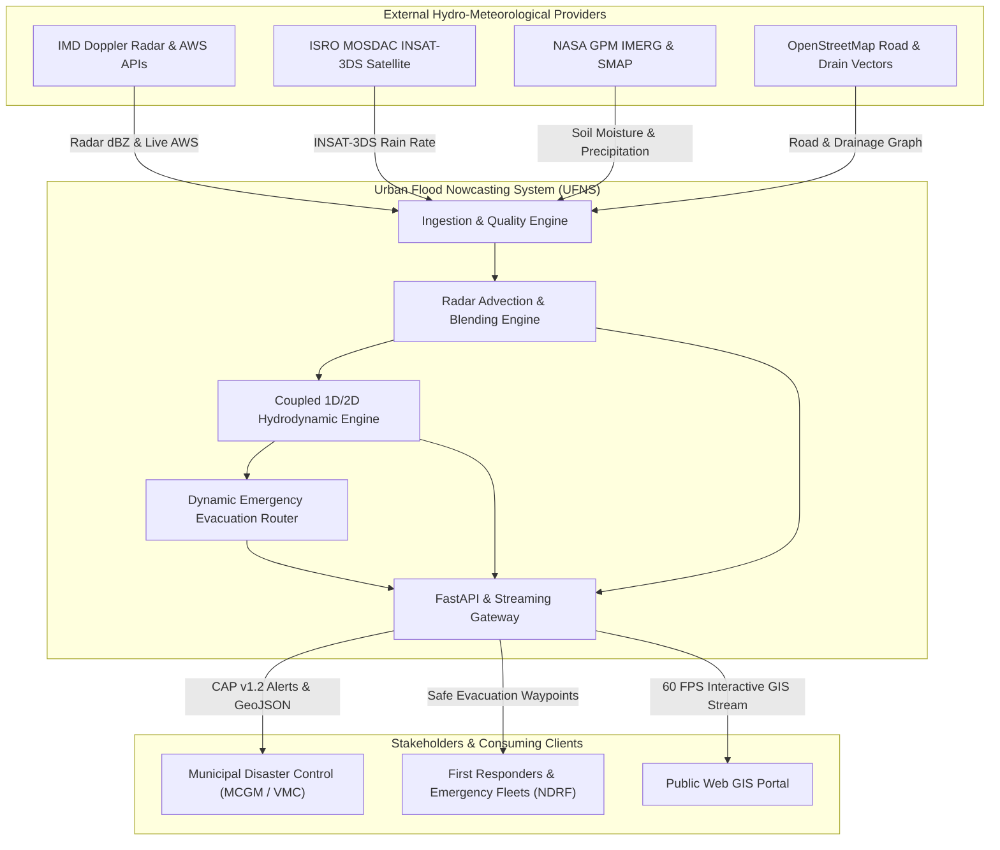
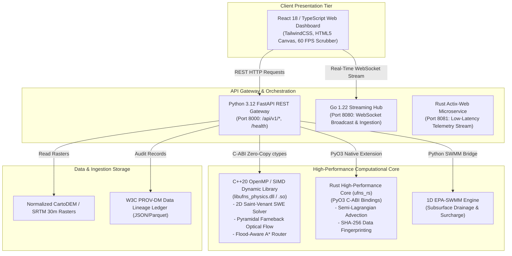
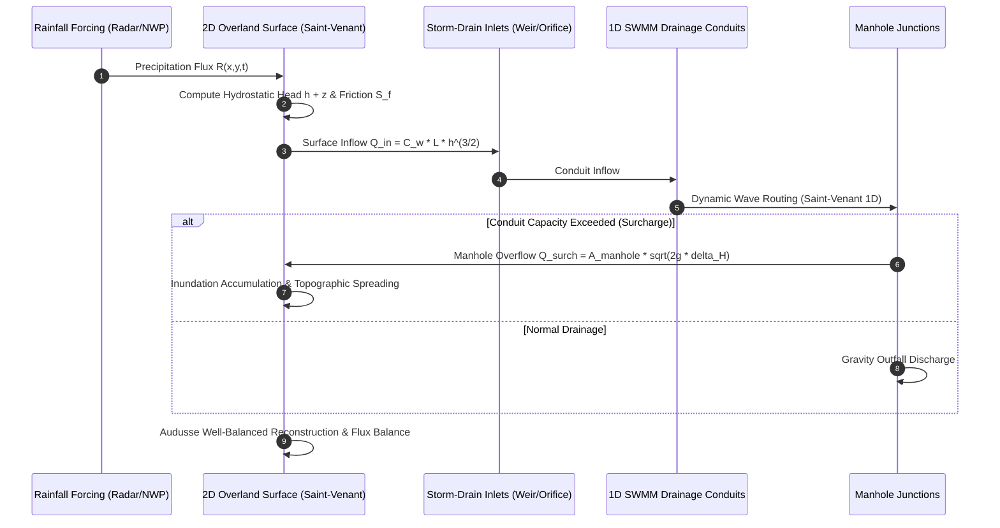
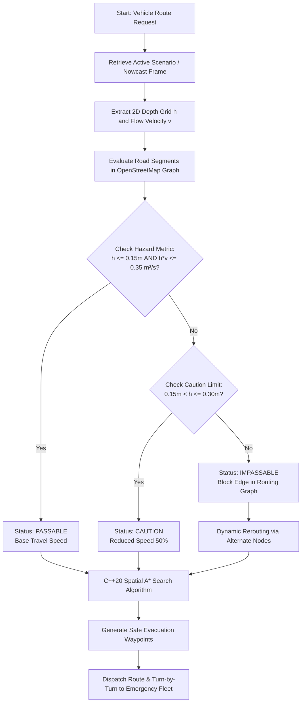

# UFNS Complete System Architecture Diagrams

This document contains architectural diagrams (Mermaid format) representing the complete **Urban Flood Nowcasting System (UFNS v4.2.0)**.

---

## 1. C4 Context Diagram (System Ecosystem)

---

## 2. C4 Container Diagram (Polyglot Microservices)

---

## 3. Coupled 1D/2D Hydrodynamic Numerical Solver Flow

---

## 4. Emergency Evacuation Route Evaluation Flow

